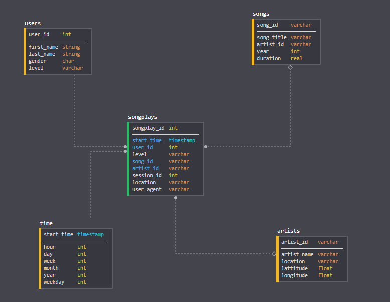

# Project: Data Warehouse

## Introduction
A music streaming startup, Sparkify, has grown their user base and song database and want to move their processes and data onto the cloud. Their data resides in S3, in a directory of JSON logs on user activity on the app, as well as a directory with JSON metadata on the songs in their app.

As their data engineer, you are tasked with building an ETL pipeline that extracts their data from S3, stages them in Redshift, and transforms data into a set of dimensional tables for their analytics team to continue finding insights in what songs their users are listening to. You'll be able to test your database and ETL pipeline by running queries given to you by the analytics team from Sparkify and compare your results with their expected results.

## Project Description
In this project, you'll apply what you've learned on data warehouses and AWS to build an ETL pipeline for a database hosted on Redshift. To complete the project, you will need to load data from S3 to staging tables on Redshift and execute SQL statements that create the analytics tables from these staging tables.

***

## Document Process

> Discuss the purpose of this database in the context of the startup, Sparkify, and their analytical goals.

As Data Engineer at Sparkify I desinged a star schema model to facilitate the processes of queriying the data about the habits of the users of our music platform. The company has grown and now we want to move our data to the cloud. Amazon web services (AWS) seems to offer the best solution for a startup like Sparkify. Being in the cloud will enable us to continue to grow our business and users community withoud worrying about infrastructure problems. We want to focus on what is really important for us: offering a better experience when it comes to listen to the music.

Again, I modeled the database using the Star Schema Model but now we are taking the advantage of Amazon Redshift, a fast, scalable data warehouse that makes it simple and cost-effective to analyze all your data across your data warehouse and data lake. We have got one Fact table, "songplays" along with four more Dimension tables named "users", "songs", "artists" and "time". We have also developed an automated pipeline to transfer all the informations from JSON files also stored in the cloud (Amazon Simple Storage Service or Amazon S3, in short) to the tables of our model in Redshift using Python.

> State and justify your database schema design and ETL pipeline.

Redshift delivers faster performance than other data warehouses. It uses machine learning, massively parallel query execution, and columnar storage on high-performance disk. It was super easy to setup and deploy a new data warehouse and run queries across petabytes of data. You can start small and easily scale. For many reasons we have chosen this solution in this new step in our business. We believe that by doing this way we adquire such a valueable tool to enable us to move our business forward. Along with our new automated pipeline reading data from Amazon S3 we are convinced that the analytics team now have a even better solution that will help to understand our users.
